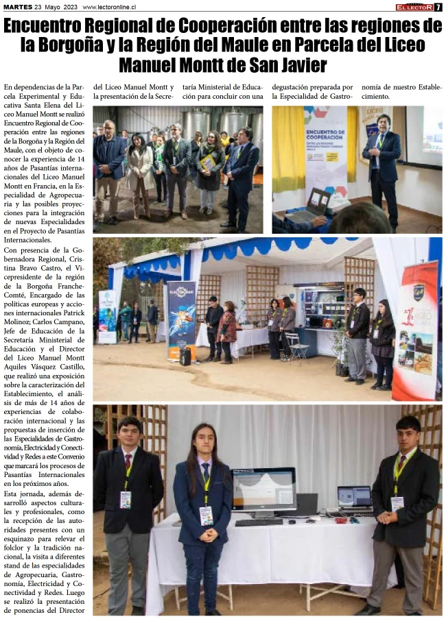

Soy un desarrollador con experiencia en tecnologias WEB y diversas tecnologias que eh aprendido de forma autonoma

<!-- truncate -->

## Sobre mí 👋

Hola, soy **Fernando Garrido**, también conocido como _SiberianCoffe_. Soy un apasionado de las tecnologías y la programación, con más de 6 años de experiencia **dedicados al estudio**, la práctica y la aplicación de mis conocimientos en una amplia variedad de proyectos, tanto de código abierto como de productos privados durante mi proceso de aprendizaje en la Universidad.

## Mi experiencia 🌟

Mi formación es principalmente autodidacta, aprovechando recursos en línea, como documentación oficial y cursos (la mayoría gratuitos). Este enfoque surgió como complemento a mi educación universitaria, permitiéndome reforzar y ampliar mis habilidades técnicas.

He trabajado en proyectos reales que van desde aplicaciones de escritorio hasta sitios web y bots con integración de APIs externas. En ellos, he resuelto tanto problemas técnicos como necesidades de los usuarios finales, enfocándome siempre en crear soluciones prácticas y funcionales.

Además, he tenido la oportunidad de realizar pequeñas charlas sobre software en una institución de educación media. Estas charlas consistieron en introducciones al sector tecnológico y demostraciones prácticas de la carrera de desarrollo de software, dirigidas tanto a nuevos estudiantes como a personas de otras áreas. Puedes leer más sobre estas charlas en el siguiente enlace: [Diario El Lector, 23 de mayo de 2023](https://issuu.com/diarioellector/docs/martes_23_de_mayo_2023/6).

  

## Filosofía de desarrollo 🚀

Mis proyectos suelen tener un doble propósito: **aprender nuevas tecnologías** y **mantener un alto estándar de calidad en el desarrollo**. Creo firmemente en la importancia de la mantenibilidad del software, asegurando que mis soluciones sean sostenibles y escalables a lo largo del tiempo.
